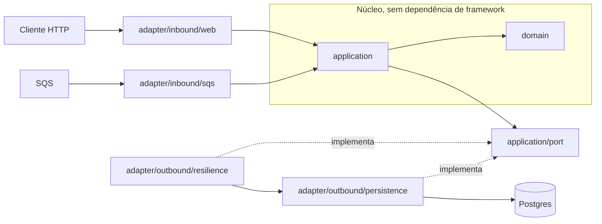

# Transaction Authorizer

API de autorização de transações financeiras: consome eventos de abertura de conta de
uma fila AWS SQS e autoriza operações de crédito e débito sobre o saldo, com a
invariante de que um débito nunca deixa o saldo negativo.

Kotlin sobre Java 21, Spring Boot com MVC e virtual threads, PostgreSQL acessado por
`JdbcClient` sem ORM, e o SDK v2 da AWS para o consumo da fila.

## Arquitetura

Arquitetura hexagonal num único módulo Gradle. O núcleo (`domain`, `application`) não
conhece Spring nem SQS nem JDBC; os adaptadores dependem para dentro, e a suíte ArchUnit
falha o build se essa direção for violada. As duas vias de entrada, o consumo da fila e a
autorização HTTP, atravessam a mesma aplicação até o Postgres.



A seta cheia é dependência de compilação, sempre apontando para o núcleo; o adaptador de
persistência implementa uma porta declarada na `application`, então a `application` depende
da abstração, não do JDBC. A invariante de saldo nunca-negativo não vive em Kotlin: mora
num update condicional atômico no adaptador de persistência, onde dois débitos concorrentes
não conseguem ambos passar.

A mesma costura é o que deixa a resiliência fora do núcleo: o circuit breaker é um segundo
implementador da porta de transações, que embrulha o adaptador de persistência e responde
por ele quando o banco não está alcançável (ADR-008). A `application` continua injetando a
porta e não sabe que existe um breaker. Decisões e trade-offs em `docs/adr/`.

## Execução

Pré-requisitos: Docker e acesso à internet (a subida baixa certificados e módulos Go
para gerar as mensagens de seed). Um único comando sobe o sistema inteiro, já
conteinerizado:

```bash
docker compose up --build
```

Health check: `curl http://localhost:8080/actuator/health`

O compose sobe cinco serviços: Postgres, localstack, um `sqs-configurator` que cria a
fila principal e a sua dead-letter queue com política de redrive, o `message-generator`,
que semeia as 100 mil mensagens e termina, e a aplicação. Ela nunca cria filas: o que
espera encontrar é criado por infraestrutura, aqui e em produção. A aplicação espera o
gerador terminar antes de subir, então na primeira execução já há mensagens para drenar.

A imagem é multi-stage: build no JDK 21 e runtime num JRE slim, com o jar em camadas
para as dependências cacharem separadas do código, rodando como usuário sem privilégio.
É a mesma imagem que iria para um registro, então o que se testa aqui é o que se publica.

Sobre as dependências, vale a distinção porque ela aparece nos modos de falha: **só o
banco é dependência de execução.** A migração roda na partida e a readiness segue o
banco, então sem Postgres não há autorização. Com a fila inalcançável o poller recua com
full jitter e a via HTTP continua atendendo; o compose espera pela fila e pelo gerador
para *semear*, não porque a aplicação precise deles. Detalhes em `docs/failure-modes.md`.

Se as portas padrão (5432, 4566, 8080) já estiverem em uso, `POSTGRES_PORT`,
`LOCALSTACK_PORT` e `APP_PORT` remapeiam o lado host do compose. Toda a configuração tem
padrão para execução local e é sobrescrevível por variável de ambiente: `DB_URL`,
`DB_USERNAME`, `DB_PASSWORD`, `DB_POOL_SIZE`, `DB_CONNECTION_TIMEOUT_MS`, `SQS_ENDPOINT`,
`SQS_QUEUE_NAME`, `SQS_POLLERS`, `AWS_REGION`, `AWS_ACCESS_KEY_ID`, `AWS_SECRET_ACCESS_KEY`
e `SERVER_PORT`. Em ambiente real, `SQS_ENDPOINT` fica vazio (o SDK resolve o endpoint da
região) e as chaves também, e aí a credencial vem da role da instância. `APP_BIND` publica
a porta da aplicação além do loopback, que é o que permite alcançá-la de outra máquina.

## Autorização de transações

`POST /transactions/{transactionId}` autoriza um crédito ou débito contra o saldo. O
`transactionId` é gerado pelo cliente e é idempotente: reenviar o mesmo id devolve a
decisão original sem mover o saldo de novo.

```bash
curl -X POST "http://localhost:8080/transactions/$(uuidgen)" \
  -H 'Content-Type: application/json' \
  -d '{"account_id":"<uuid da conta>","type":"DEBIT","amount":{"value":10.50,"currency":"BRL"}}'
```

Aprovação e recusa retornam ambas 200, diferindo no campo `transaction.status`
(`SUCCEEDED` ou `FAILED`): uma recusa por fundo insuficiente é uma decisão de negócio, não
um erro. Requisição malformada é 400, conta inexistente é 404, e moeda diferente de BRL
ou valor fora da faixa é 422, todos como `application/problem+json`. Quando o
armazenamento está indisponível a resposta é 503 com `Retry-After`, e não uma recusa: o
serviço não decidiu, e dizer isso é diferente de dizer não (ADR-008). Contrato completo em
`docs/openapi.yaml`.

Para exercer cada um desses comportamentos sem montar requisição à mão, `docs/http/` traz
a coleção de primeiro contato em dois formatos, um `.http` nativo de IDE e uma coleção
Postman, com a nota de como obter um `account_id` semeado.

## Observabilidade

- Logs estruturados em JSON no stdout, com `transactionId` na via HTTP e `messageId` na
  via de consumo para correlação.
- Métricas Prometheus em `/actuator/prometheus`: `authorizations_total` com desfecho e
  motivo, `sqs_messages_total` com desfecho, `authorizations_circuit_open`, os gauges
  `hikaricp_connections_*` da saturação do pool e o histograma
  `http_server_requests_seconds_bucket`, de onde sai o p99 que o gate de rollout lê
  (`docs/deploy.md`).
- Health em grupos: `/actuator/health/liveness` sem dependência,
  `/actuator/health/readiness` seguindo o banco, e o SQS como componente à parte.

## Loop de desenvolvimento

Para iterar no código sem reconstruir a imagem a cada mudança, o mesmo compose sobe só
as dependências e a aplicação roda pela JVM local. Requer JDK 21, que é o LTS alinhado ao
que roda em produção hoje, não uma versão presa por inércia: os recursos de que o serviço
depende (virtual threads, entre outros) já são estáveis nela.

```bash
# Sobe Postgres, localstack, a topologia de filas e o gerador, sem a aplicação
docker compose up -d --scale app=0

# Aguarda a mensagem "message-generator exited with code 0"
docker compose logs -f message-generator

# Roda a aplicação pela JVM local
./gradlew bootRun
```

`DB_URL`, `SQS_ENDPOINT` e `SERVER_PORT` apontam a aplicação para as portas escolhidas
quando ela roda fora do compose.

Os dois fluxos semeiam a mesma base: rodar um depois do outro sem um `docker compose
down -v` entre eles refaz o seed sobre um banco já semeado, dobrando as contas. `bin/e2e`
e `bin/chaos` já cuidam disso e derrubam os volumes antes de subir.

O exemplo de `curl` acima usa `uuidgen` (pacote `util-linux` na maioria das
distros). `bin/ci` só roda a varredura de segredos localmente se o `gitleaks` estiver
instalado (`bin/install-hooks` cuida disso); sem ele esse gate específico existe só no CI.

## Verificação

```bash
bin/ci    # formato, lint, testes e cobertura, o mesmo gate do CI
bin/e2e   # smoke de ponta a ponta sobre o sistema conteinerizado (Docker, curl e jq)
bin/chaos # derruba o Postgres e prova a resiliência das duas vias (Docker, curl, uuidgen)
```

`bin/e2e` sobe o sistema inteiro do zero, espera a semente e a readiness,
credita e debita uma conta semeada, confere a recusa por saldo, o replay idempotente e o
404, e derruba tudo ao final. É o ensaio do primeiro contato de quem chega pelo README,
rodado localmente antes de uma entrega. Não integra o `bin/ci` porque sobe containers e a
semente de 100 mil mensagens.

## Decisões e onde lê-las

Quatro decisões sustentam o desenho e são as que um leitor pode querer contestar. Cada uma
está argumentada por escrito, com as alternativas que foram pesadas e recusadas.

| Decisão | Onde está |
|---|---|
| Livro-razão relacional ACID, e recusar em vez de aprovar um débito que não se consegue verificar sob partição | [ADR-007](docs/adr/007-armazenamento-relacional-acid.md), a escolha do armazenamento; [ADR-002](docs/adr/002-controle-de-concorrencia-do-saldo.md), o update condicional atômico do saldo |
| Núcleo sem dependência de framework, com a direção fixada por teste e não por convenção | [`HexagonalArchitectureTest`](src/test/kotlin/com/transactionauthorizer/architecture/HexagonalArchitectureTest.kt), que derruba o build se um adaptador inverter a seta |
| Degradar sob falha de dependência sem nunca corromper o saldo nem perder mensagem válida | [ADR-008](docs/adr/008-circuit-breaker-da-autorizacao.md), o circuit breaker e o timeout que o torna possível; [`docs/failure-modes.md`](docs/failure-modes.md), componente a componente |
| Frota dimensionada pelo orçamento de conexão do banco, não pela CPU | [ADR-009](docs/adr/009-orquestrador-e-dimensionamento-da-frota.md) e [`docs/scale.md`](docs/scale.md), com a medição de saturação do pool que descarta a métrica de CPU |

## Documentação

- [`ROADMAP.md`](ROADMAP.md): o que existe, o que viria a seguir e o que está fora de escopo.
- [`docs/adr/`](docs/adr/): decisões de arquitetura com motivadores e trade-offs.
- [`docs/openapi.yaml`](docs/openapi.yaml): contrato HTTP da autorização.
- [`docs/http/`](docs/http/): coleção de requisições, formato `.http` e Postman.
- [`docs/failure-modes.md`](docs/failure-modes.md): por componente, o que acontece quando ele falha.
- [`docs/deploy.md`](docs/deploy.md): topologia de deploy em cloud pública e proposta de pipeline.
- [`docs/scale.md`](docs/scale.md): capacidade da frota, o teto de conexões e o que muda a 10x e a 100x.
- [`docs/load/`](docs/load/): prova de carga com k6, método, cenários e resultados.
- [`deploy/`](deploy/): manifesto Kubernetes e regras de alerta do Prometheus.
