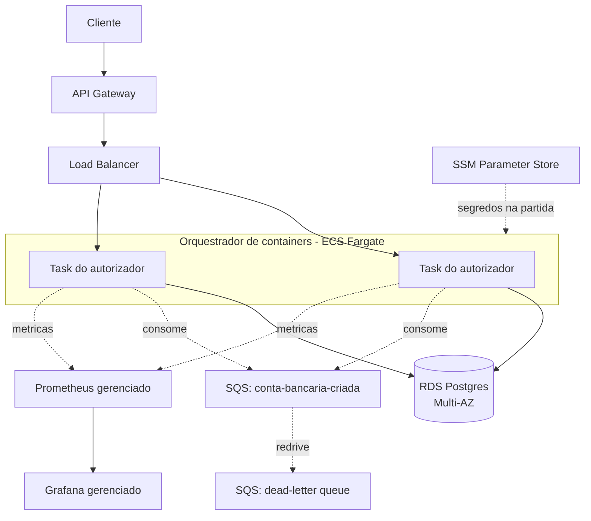
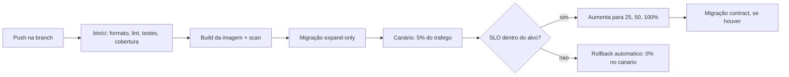

# Deploy e pipeline

Como o serviço chega a produção em cloud pública e como uma mudança é promovida com raio
de detonação limitado. Os diagramas são código mermaid; a prosa justifica cada escolha
pelo pilar de confiabilidade do Well-Architected, não por catálogo de serviços.

## Topologia de deploy

Cada salto responde à pergunta de como o serviço alcança produção com confiabilidade, e
não qual serviço da AWS cabe em cada caixa:

- **API Gateway na borda:** ponto único de entrada para throttling, autenticação e
  limites de requisição, isolando o autorizador de tráfego malformado ou abusivo antes de
  ele chegar à aplicação.
- **Load Balancer sobre múltiplas tasks:** a autorização é sem estado, então escala
  horizontalmente. O balanceador segue a readiness (`/actuator/health/readiness`) e tira
  de rotação a task cujo banco caiu, sem reiniciar o processo, que segue vivo pela
  liveness. Distribuir as tasks por zonas de disponibilidade remove o nó como ponto único
  de falha.
- **Orquestrador de containers (ECS Fargate):** reconcilia a contagem desejada de tasks,
  substitui a que morre e é o substrato do deploy canário abaixo. A imagem é a mesma que
  `docker compose --profile app` sobe localmente, então o artefato testado é o artefato
  publicado.
- **RDS Postgres Multi-AZ:** o saldo é o estado durável e a invariante de nunca-negativo
  mora num update condicional atômico do banco, então ele é o componente que mais precisa
  de durabilidade. Multi-AZ dá failover síncrono; snapshots e recuperação a um ponto no
  tempo dão o resto do orçamento de durabilidade.
- **SQS com dead-letter queue:** a fila desacopla a criação de conta do produtor e absorve
  picos. A dead-letter queue captura mensagem veneno com evidência de contagem de
  recebimento, sem bloquear a fila principal. A aplicação nunca cria filas: a topologia é
  infraestrutura, aqui e em produção.
- **SSM Parameter Store:** credencial e configuração sensível entram por variável de
  ambiente na partida, não na imagem. Em ambiente real a credencial da fila e do banco vem
  da role da task, não de chave estática.
- **Prometheus e Grafana gerenciados:** as métricas já expostas em `/actuator/prometheus`
  (autorizações, mensagens SQS, saturação do pool) são coletadas por um backend
  gerenciado, e é sobre elas que o SLO do pipeline dispara rollback.

## Pipeline com deploy de risco limitado

A estratégia escolhida é o deploy canário. O tráfego migra da versão atual para a nova
em degraus (5%, 25%, 50%, 100%), cada degrau observado antes do próximo, e uma regressão
de SLI reverte para zero automaticamente. Ela cabe neste serviço por três razões:

- **Autorizador sem estado:** fica atrás de um balanceador, então dividir tráfego entre
  versão atual e nova é uma questão de peso no balanceador, sem afinidade a uma instância.
- **Migração expand/contract:** a versão nova sobe primeiro com uma migração que só
  adiciona (coluna, tabela, índice), compatível com a versão antiga que ainda serve
  tráfego. A remoção do que ficou obsoleto vem numa migração contract posterior, depois
  que nenhuma versão antiga roda. É isso que torna o canário seguro: as duas versões
  convivem sobre o mesmo banco sem quebrar uma à outra.
- **Raio de detonação limitado:** um defeito que passou pelos testes atinge 5% das
  requisições pelo tempo de um degrau, não 100% de imediato.

O gatilho de rollback é amarrado a um par SLI/SLO observável durante cada degrau:

- **Latência p99** da autorização acima do alvo (por exemplo 150ms) sustentada pela
  janela do degrau.
- **Disponibilidade**, a fração de respostas não-5xx, abaixo do alvo (por exemplo
  99,9%) na mesma janela.

Qualquer um dos dois fora do alvo reverte o peso do canário para zero sem espera por
decisão humana. A recusa por saldo é 200, não 5xx, então uma decisão de negócio legítima
nunca é confundida com regressão de disponibilidade.

### Alternativa pesada: blue/green

O blue/green mantém dois ambientes completos e vira 100% do tráfego de um para o outro
de uma vez, com rollback igualmente instantâneo pela virada de volta. Foi pesado e
preterido:

- **A favor:** a virada é atômica e o rollback é imediato, sem estado intermediário de
  tráfego dividido para raciocinar.
- **Contra:** a exposição é tudo ou nada. Um defeito que os testes não pegaram atinge 100%
  do tráfego no instante da virada, enquanto o canário o teria contido em 5%. Manter dois
  ambientes plenos dobra o custo de infraestrutura durante a transição, e a mesma
  disciplina de migração expand/contract continua necessária, então o blue/green não
  simplifica a parte difícil.

Para um serviço sem estado, cuja preocupação central é não deixar um defeito sutil de saldo
alcançar toda a base de uma vez, a exposição gradual do canário vale o tráfego dividido
que ele introduz.
