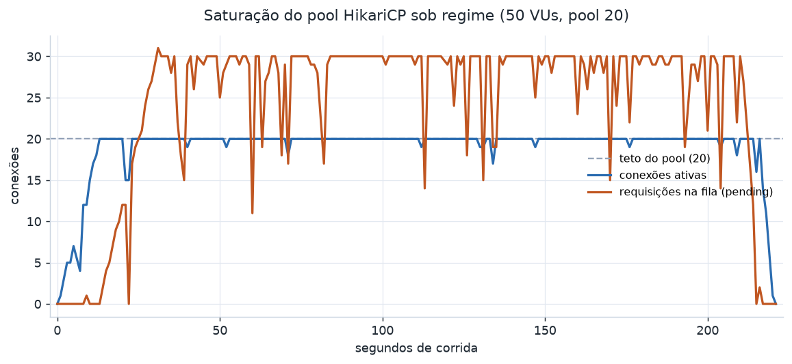

# Resultados

Números da campanha de carga, um bloco por cenário, cada um com três corridas no par
isolado. O método, o ambiente e os caveats que enquadram estes números estão no
[README](README.md); leia-os antes das tabelas.

Nenhuma corrida registrou erro: as 4,5 milhões de requisições do regime, do pico e da
conta quente responderam todas HTTP 200, incluindo os débitos recusados por saldo, que são
decisão de autorização e não falha. As três corridas por cenário mostram a faixa, não um
recorte favorável.

## Máquinas

| Papel | Tipo de instância | vCPU | Memória | Zona |
|---|---|---|---|---|
| Gerador | `c6i.xlarge` | 4 | 8 GiB | `us-east-1c` |
| SUT | `c6id.2xlarge` | 8 | 16 GiB | `us-east-1c` |

Mesma zona, tráfego medido pela rede privada. As duas rodam Ubuntu 24.04.4 sobre kernel
6.17 da AWS. No SUT: Docker 29.6.2 com Compose v5.3.1, PostgreSQL 17.5 em container e a
aplicação sobre OpenJDK 21.0.11. No gerador: k6 v2.0.0. Disco raiz gp3, e o volume NVMe
local do SUT fica sem uso, então o Postgres escreve no gp3. A campanha rodou com
`DB_POOL_SIZE=20` e `SQS_POLLERS=2`, os defaults, confirmados pela varredura mais abaixo.

## Regime

Concorrência fixa e sustentada a 50 VUs, a via HTTP isolada. É o número de referência.

| Corrida | VUs | Throughput (req/s) | p50 (ms) | p99 (ms) | Taxa de erro |
|---|---|---|---|---|---|
| 1 | 50 | 2759 | 11,2 | 82,3 | 0% |
| 2 | 50 | 2678 | 10,8 | 90,9 | 0% |
| 3 | 50 | 2564 | 11,5 | 91,7 | 0% |

Cerca de 2,7 mil autorizações por segundo com p99 abaixo de 92 ms, num único nó de
aplicação contra um Postgres em container. A variação de 7% entre corridas é a variância
natural de corrida única; a faixa é o resultado, não a média.

## Pico

Base calma de 20 VUs, salto para 200, e a volta. Os percentis são lidos sobre a corrida de
pico inteira, que mistura os dois regimes de propósito: isolar só a janela de pico exigiria
a saída time-series do k6, e a curva de fila do pool logo abaixo já mostra a absorção e a
recuperação do surto com mais clareza do que um percentil agregado mostraria.

Pelo mesmo motivo a tabela não traz o p50 que os outros cenários reportam: uma mediana sobre
uma corrida que mistura base calma e surto de propósito cai dentro da base, que é justamente
a parte que o cenário não existe para medir. O p99 e a máxima ficam no lugar dela, porque é
na cauda que o surto aparece.

| Corrida | Base VUs | Pico VUs | Throughput (req/s) | p99 (ms) | Máx (ms) | Taxa de erro |
|---|---|---|---|---|---|---|
| 1 | 20 | 200 | 2458 | 326 | 1331 | 0% |
| 2 | 20 | 200 | 2524 | 357 | 1596 | 0% |
| 3 | 20 | 200 | 2416 | 371 | 2105 | 0% |

O surto de dez vezes a base é absorvido sem um único erro. O custo aparece na cauda: o p99
sobe de ~90 ms no regime para ~350 ms no pico, e a latência máxima chega a 1 a 2 segundos
enquanto o excedente espera por uma conexão. Na telemetria do pool durante estas corridas,
a fila (`pending`) saltou de ~0 na base para um pico de 180 requisições, e voltou a zero
depois do surto: a recuperação é limpa, sem erro residual e sem cauda que persista após o
pico passar.

## Concentração em conta quente

Mesma concorrência do regime, tráfego concentrado em 10 contas. Aqui a contenção de trava
de linha do update atômico aparece: throughput e p99 pioram contra o regime, e essa
diferença é o custo honesto da serialização no saldo, não um defeito.

| Corrida | VUs | Contas quentes | Throughput (req/s) | p50 (ms) | p99 (ms) | Taxa de erro |
|---|---|---|---|---|---|---|
| 1 | 50 | 10 | 1853 | 13,9 | 222 | 0% |
| 2 | 50 | 10 | 1851 | 14,3 | 213 | 0% |
| 3 | 50 | 10 | 1756 | 14,9 | 222 | 0% |

O throughput cai de ~2,7 mil para ~1,8 mil req/s, um terço a menos, e o p99 mais que dobra,
de ~90 ms para ~220 ms. É exatamente o comportamento projetado: quando muitas requisições
disputam a mesma linha, o update condicional atômico as serializa no lock de linha em vez
de deixar duas debitarem o mesmo saldo. Sob carga uniforme sobre 100 mil contas isso fica
invisível, porque duas requisições quase nunca tocam a mesma linha; concentrar o tráfego
torna o custo mensurável. Que não haja erro nem saldo negativo sob essa contenção é a
invariante do sistema aparecendo na medição.

## Saturação do pool HikariCP

Corrida de regime, 50 VUs contra um pool de 20. As conexões ativas sobem e grudam no teto
de 20, e a fila (`pending`) se estabiliza em torno de 30, com pico de 31: o excedente de VUs
que não cabe no pool espera, e 50 VUs menos as 20 conexões do pool são exatamente as 30 que
esperam. É a evidência do teto projetado. Sob virtual threads o gargalo
de concorrência é o pool de conexões, não uma contagem de threads, então cada requisição
que precisa do banco pega uma conexão e as demais enfileiram. Fonte de dados em
`hikari.csv`, coletado por `scripts/scrape-hikari.sh`.

O disco não é o teto escondido atrás do pool. Durante o regime o Postgres escreveu no gp3 a
~2,5 mil operações por segundo, mas a latência de escrita ficou em 3,7 ms de média e 8,6 ms
no p95, e a profundidade de fila do dispositivo acompanhou a fila do pool. O `%util` do
disco fica perto de 100%, mas em SSD isso indica só que havia I/O em voo, não saturação; a
latência de escrita, que dispararia se o disco fosse a parede, permaneceu baixa. O teto
medido é o pool. Fonte de dados em `iostat.csv`, coletado por `scripts/scrape-iostat.sh` na
mesma janela do gráfico acima: a média e o p95 são sobre as amostras de um segundo.

## Tuning medido

Os valores de partida foram escolhidos por raciocínio, e a varredura os confirma com
medição. Cada ponto de pool diferente de 20 é uma corrida única de regime; o pool 20 é a
média das três corridas de referência.

| Pool | Throughput (req/s) | p99 (ms) |
|---|---|---|
| 10 | 1852 | 203 |
| 20 | 2667 | 88 |
| 40 | 2769 | 55 |
| 80 | 2217 | 46 |

O formato da curva é o que importa. Em 10 o pool estrangula: um terço menos throughput, o
banco ocioso esperando conexão que não existe. De 20 para 40 o throughput mal se move, 4%,
dentro da variância de 7% que as corridas de regime já mostraram. Em 80 o throughput
**cai**: passado o joelho, mais conexões só disputam CPU, disco e locks do banco sem
atender mais ninguém. A queda em 80 é a prova de que o pool é o controle de concorrência
funcionando, não um número a maximizar.

| Parâmetro | Partida | Final | Evidência |
|---|---|---|---|
| `DB_POOL_SIZE` (HikariCP) | 20 | 20 | 10 estrangula, 80 regride; 20 fica no joelho da curva |
| `SQS_POLLERS` | 2 | 2 | fora da via HTTP medida; afeta só a drenagem da semente |

O default de 20 se mantém, agora por medição e não por palpite. O pool 40 insinua uma cauda
melhor (p99 55 contra 88 ms) sem custar throughput, mas repousa numa corrida só, então não
justifica trocar o valor entregue; é um candidato a confirmar com n maior, não uma
conclusão. A contagem de pollers não toca a via HTTP medida, só a velocidade com que a
semente drena antes da campanha, então fica no default.
