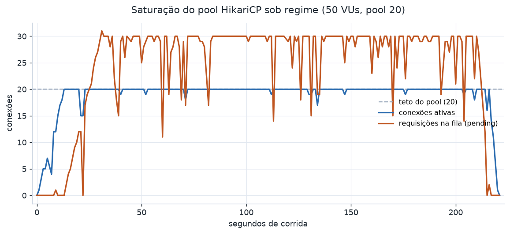

# Resultados

Números da campanha de carga, um bloco por cenário, cada um com três corridas no par
isolado. O método, o ambiente e os caveats que enquadram estes números estão no
[README](README.md); leia-os antes das tabelas.

Nenhuma corrida registrou erro: as 3.775.191 requisições do regime, do pico e da
conta quente responderam todas HTTP 200, incluindo os débitos recusados por saldo, que são
decisão de autorização e não falha.

As tabelas abaixo são derivadas, não a fonte. Os artefatos que as produzem estão em dois
diretórios e permitem refazer qualquer linha sem religar as máquinas: [results/](results/)
guarda os cenários e a primeira varredura de pool, e [results2/](results2/) guarda a
varredura refeita, cuja leitura está na última seção desta página.

| Artefato | O que é |
|---|---|
| `results/k6/*.json` | O sumário do k6 das doze corridas da primeira etapa: três por cenário e três da primeira varredura de pool |
| `results/hikari-campaign.csv` | Os gauges do pool por segundo, com epoch, cobrindo regime, pico e conta quente |
| `results/manifest.csv` | Início, fim e código de saída de cada corrida, que é o que permite recortar o CSV na janela de qualquer cenário |
| `results2/` | As onze corridas da varredura refeita, com os gauges do pool, a CPU por container e o manifesto próprio. O [README de lá](results2/README.md) descreve cada arquivo |

Uma ressalva de honestidade sobre o que estes números medem: a campanha rodou antes do
circuit breaker da autorização (ADR-008) entrar no caminho, e não foi refeita depois. O que
o breaker acrescenta por requisição, com o circuito fechado, é um contador em memória, sem
I/O e sem lock disputado, e o `connectionTimeout` de 3s que veio junto só tem efeito acima
de qualquer espera observada aqui. Ainda assim, as tabelas abaixo descrevem o
comportamento do artefato sem essa camada, e é assim que devem ser lidas. Refazer a
campanha sobre o artefato atual é o que fecharia a diferença.

## Máquinas

| Papel | Tipo de instância | vCPU | Memória | Zona |
|---|---|---|---|---|
| Gerador | `c6i.xlarge` | 4 | 8 GiB | `us-east-1c` |
| SUT | `c6id.2xlarge` | 8 | 16 GiB | `us-east-1c` |

Mesma zona, tráfego medido pela rede privada. As duas rodam Ubuntu 24.04.4 sobre kernel
6.17 da AWS. No SUT: Docker 29.6.2 com Compose v5.3.1, PostgreSQL 17.5 em container e a
aplicação sobre OpenJDK 21.0.11. No gerador: k6 v2.0.0. Disco raiz gp3, e o volume NVMe
local do SUT fica sem uso, então o Postgres escreve no gp3. A campanha rodou com
`DB_POOL_SIZE=20` e `SQS_POLLERS=2`, os defaults, confirmados pela varredura mais abaixo.

## Regime

Concorrência fixa e sustentada a 50 VUs, a via HTTP isolada. É o número de referência.

| Corrida | VUs | Throughput (req/s) | p50 (ms) | p99 (ms) | Taxa de erro |
|---|---|---|---|---|---|
| 1 | 50 | 2759 | 11,2 | 82,3 | 0% |
| 2 | 50 | 2678 | 10,8 | 90,9 | 0% |
| 3 | 50 | 2564 | 11,5 | 91,7 | 0% |

Cerca de 2,7 mil autorizações por segundo com p99 abaixo de 92 ms, num único nó de
aplicação contra um Postgres em container. A variação de 7% entre corridas é a variância
natural de corrida única, e é a faixa que responde pelo resultado.

## Pico

Base calma de 20 VUs, salto para 200, e a volta. Os percentis são lidos sobre a corrida de
pico inteira, que mistura os dois regimes de propósito: isolar só a janela de pico exigiria
a saída time-series do k6, e a curva de fila do pool logo abaixo já mostra a absorção e a
recuperação do surto com mais clareza do que um percentil agregado mostraria.

Pelo mesmo motivo a tabela não traz o p50 que os outros cenários reportam: uma mediana sobre
uma corrida que mistura base calma e surto cai dentro da base, que é a parte que o cenário
não existe para medir. O p99 e a máxima ficam no lugar dela, porque é na cauda que o surto
aparece.

| Corrida | Base VUs | Pico VUs | Throughput (req/s) | p99 (ms) | Máx (ms) | Taxa de erro |
|---|---|---|---|---|---|---|
| 1 | 20 | 200 | 2458 | 326 | 1331 | 0% |
| 2 | 20 | 200 | 2524 | 357 | 1596 | 0% |
| 3 | 20 | 200 | 2416 | 371 | 2105 | 0% |

O surto de dez vezes a base é absorvido sem um único erro. O custo aparece na cauda: o p99
sobe de ~90 ms no regime para ~350 ms no pico, e a latência máxima chega a 1 a 2 segundos
enquanto o excedente espera por uma conexão. Na telemetria do pool durante estas corridas,
a fila (`pending`) saltou de ~0 na base para um pico de 180 requisições, e voltou a zero
depois do surto: a recuperação é limpa, sem erro residual e sem cauda que persista após o
pico passar.

## Concentração em conta quente

Mesma concorrência do regime, tráfego concentrado em 10 contas. Aqui a contenção de trava
de linha do update atômico aparece: throughput e p99 pioram contra o regime, e essa
diferença é o custo honesto da serialização no saldo, não um defeito.

| Corrida | VUs | Contas quentes | Throughput (req/s) | p50 (ms) | p99 (ms) | Taxa de erro |
|---|---|---|---|---|---|---|
| 1 | 50 | 10 | 1853 | 13,9 | 222 | 0% |
| 2 | 50 | 10 | 1851 | 14,3 | 213 | 0% |
| 3 | 50 | 10 | 1756 | 14,9 | 222 | 0% |

O throughput cai de ~2,7 mil para ~1,8 mil req/s, um terço a menos, e o p99 mais que dobra,
de ~90 ms para ~220 ms. É o comportamento projetado: quando muitas requisições disputam a
mesma linha, o update condicional atômico as serializa no lock de linha em vez de deixar
duas debitarem o mesmo saldo. Sob carga uniforme sobre 100 mil contas isso fica
invisível, porque duas requisições quase nunca tocam a mesma linha; concentrar o tráfego
torna o custo mensurável. Que não haja erro nem saldo negativo sob essa contenção é a
invariante do sistema aparecendo na medição.

## Saturação do pool HikariCP

Corrida de regime, 50 VUs contra um pool de 20. As conexões ativas sobem e grudam no teto
de 20, e a fila (`pending`) se estabiliza em torno de 30, com pico de 31: o excedente de VUs
que não cabe no pool espera, e 50 VUs menos as 20 conexões do pool são exatamente as 30 que
esperam. É a evidência do teto projetado: sob virtual threads o gargalo de concorrência é o
pool de conexões, então cada requisição que precisa do banco pega uma e as demais enfileiram.
Fonte de dados em `results/hikari-campaign.csv`, coletado por `scripts/scrape-hikari.sh`.

O disco não é o teto escondido atrás do pool. Um `iostat -x 1` acompanhou a campanha, e
sobre as suas 2.779 amostras de um segundo o Postgres escreveu no gp3 a ~2,5 mil operações
por segundo, com latência de escrita de 3,7 ms de média, 8,6 ms no p95 e 31 ms no pior
segundo. O `%util` do disco fica perto de 100%, mas em SSD isso indica só que havia I/O em
voo, não saturação; a latência de escrita, que dispararia se o disco fosse a parede, não
passou de dezenas de milissegundos nem no pior segundo. O teto medido é o pool.

A janela desses números é a campanha inteira, não o recorte do gráfico acima. O `iostat -x 1`
não carimba epoch por linha, então a saída bruta não tem como ser reduzida a um cenário: ela
mistura os três cenários, a varredura de pool e os intervalos ociosos entre corridas, e a
ociosidade puxa a média para baixo. Por isso a leitura se apoia no p95 e no pior segundo, e
não na média, e por isso nada aqui afirma correlação entre a fila do dispositivo e a do pool,
que exigiria alinhar as duas séries no tempo. `scripts/scrape-iostat.sh` existe para a
próxima campanha: ele carimba epoch por amostra e descarta a média desde o boot, então uma
corrida futura fica recortável à janela de um cenário, o que esta não é.

É também o único dado bruto da campanha que não está publicado em [results/](results/), e a
falta de carimbo é o motivo: sem epoch por amostra o arquivo não pode ser alinhado às
janelas do `manifest.csv`, então publicá-lo ofereceria volume sem oferecer verificação. Uma
tentativa de ancorá-lo por correlação contra a série do pool, que tem epoch, não passou:
r = 0,08, indistinguível de ruído.

## Tuning medido

A primeira varredura desta campanha produziu uma leitura errada, e o erro está descrito em
[a varredura refeita](#a-varredura-refeita-e-o-que-a-primeira-mediu-de-fato) abaixo, junto
com o que a medição corrigida mostra. O parágrafo seguinte é o que sobrevive dela.

| Pool | Throughput (req/s) | p99 (ms) |
|---|---|---|
| 10 | 1852 | 203 |
| 20 | 2667 | 88 |
| 40 | 2769 | 55 |
| 80 | 2217 | 46 |

A linha de 20 não tem corrida própria: é a média das três corridas de regime, que rodaram
nesse mesmo tamanho de pool e sob a mesma carga oferecida. As outras três têm cada uma o
seu `results/k6/sweep-pool*.json`.

Em 10 o pool estrangula, e isso se sustenta: um terço menos throughput, o banco ocioso
esperando conexão que não existe. Os demais pontos não medem o que a tabela sugere.

| Parâmetro | Partida | Final | Evidência |
|---|---|---|---|
| `DB_POOL_SIZE` (HikariCP) | 20 | 20 | 10 estrangula; 20 atende com folga de CPU e é o valor entregue |
| `SQS_POLLERS` | 2 | 2 | fora da via HTTP medida; afeta só a drenagem da semente |

A contagem de pollers não toca a via HTTP medida, só a velocidade com que a semente drena
antes da campanha, então fica no default.

## A varredura refeita, e o que a primeira mediu de fato

A primeira varredura variou `DB_POOL_SIZE` mantendo a carga oferecida fixa em 50 VUs. Com
cinquenta requisições em voo, um pool de 80 nunca tem mais de cinquenta conexões ocupadas,
então o ponto rotulado 80 mediu, na melhor das hipóteses, cinquenta. A comparação entre 40 e
80 não era entre dois tamanhos de pool: era entre o mesmo número de conexões trabalhando.

Havia um segundo defeito, e ele é o mais interessante. Os pontos rodaram por último e em
ordem crescente de pool, sobre uma base que nunca foi reiniciada, então tamanho de pool
estava perfeitamente correlacionado com tamanho da tabela. O que a curva leu como "mais
conexões pioram" era o livro-razão engordando.

A refação corrige as duas coisas: carga oferecida constante em 160 VUs em todos os pontos,
para que o pool seja o limitante em qualquer tamanho, ordem não monotônica, e um ponto de
controle em pool 20 repetido seis vezes ao longo da campanha para transformar o drift de
confundidor invisível em quantidade medida. Os dados brutos das onze corridas estão em
[results2/](results2/), com o manifesto que permite recortar as séries por janela.

### Mais conexões não reduzem vazão

| Pool | Conexões ativas | Saturação | Fila | Throughput (req/s) | p99 (ms) |
|---|---|---|---|---|---|
| 20 | 19,7 de 20 | 98,6% | 134 | 3115 | 294 |
| 80 | 78,4 de 80 | 98,0% | 72 | 4054 | 163 |

Os dois pools saturados a 98%, que é a condição que a primeira varredura não conseguia
alcançar. Quadruplicar as conexões entrega 30% mais vazão e uma cauda 45% menor: a fila
encurta de 134 para 72 requisições, e é a fila que produzia o p99. O host fica com 35% a 48%
de CPU ociosa nos dois casos, então nada disso é limite de processador.

O resultado foi replicado três vezes ao longo da campanha, comparando o ponto de 80 com os
controles vizinhos: 32%, 23% e 30% de ganho. Nas três, o ponto de 80 rodou sobre uma base
maior que a do controle anterior, ou seja com o drift jogando contra, e ganhou mesmo
assim. Não há joelho até 80.

### O teto se move com o volume acumulado, não com a carga

Este é o achado que a primeira campanha não podia ter, porque não repetia o controle. Seis
corridas de configuração idêntica, pool 20 e 160 VUs, ao longo de toda a campanha:

| Linhas no livro-razão | Throughput (req/s) |
|---|---|
| 0 | 6202 |
| 4,7M | 5318 |
| 7,7M | 4193 |
| 8,9M | 3753 |
| 11,1M | 3244 |
| 12,0M | 3115 |

Metade da vazão perdida enquanto o livro-razão vai de zero a doze milhões de linhas, sem
mudar uma linha de configuração. As duas tabelas de alto volume de escrita são append-only,
com chave primária aleatória, e cada inserção cai numa folha diferente do índice; o custo
disso cresce com o tamanho da tabela. A CPU do host não acompanha a queda, o que aponta para
I/O de índice e não para disputa de processador.

A consequência prática é que um teto medido tem prazo de validade. Qualquer número de
capacidade deste serviço só significa alguma coisa acompanhado do tamanho da base em que foi
medido, e planejamento de capacidade aqui precisa de retenção ou particionamento por tempo,
não de mais réplicas. Nenhuma corrida de três minutos captura isso.
